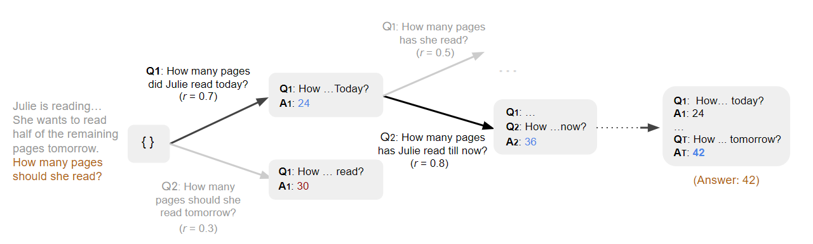

---


**LLM Reasoners** is a library to support advanced reasoning with LLMs. It approaches multi-step reasoning as planning and search for the optimal reasoning chain. Given any reasoning problems, users can easily define a search configuration and an optional world model (explained below), while LLM reasoners takes care of the rest, including Search Algorithms, Visualization, LLM calling, and more!

## Why Choose LLM Reasoners?

- **Cutting-Edge Algorithms**: We offer the most up-to-date search algorithms for reasoning, such as [RAP-MCTS](https://arxiv.org/abs/2305.14992), [ToT](https://arxiv.org/abs/2305.10601), [Guided Decoding](https://arxiv.org/abs/2305.00633), and more. These advanced algorithms enable tree-structure reasoning and outperform traditional chain-of-thoughts approaches.

- **Intuitive Visualization**: Our platform provides visualization tools to aid users in comprehending the reasoning process. Even for the most complex reasoning algorithms like Monte-Carlo Tree Search, users can easily diagnose and understand what occurred.

- **User-Friendly LLM Wrapper**: Our framework is compatible with any LLM framework, and we have specifically included common helper functions to simplify its usage. We support LLaMA with the option of using [fairscale](https://github.com/facebookresearch/llama) backend for improved multi-GPU performance or [LLaMA.cpp](https://github.com/ggerganov/llama.cpp) backend with lower hardware requirements.

## Understanding LLM Reasoners

Let's begin with classic chain-of-thought reasoning. Provided with a few examples of problem-solving step by step, the LLM is capable of generating a chain of thoughts to solve a new problem. For instance, consider the following example:

> [Few-shots examples of chain-of-thought reasoning]
> 
> Q: Julie is reading a 120-page book. Yesterday, she was able to read 12 pages and today, she read twice as many pages as yesterday. If she wants to read half of the remaining pages tomorrow, how many pages should she read?
> 
> A: *Julie read 12 x 2 = 24 pages today. So she was able to read a total of 12 + 24 = 36 pages since yesterday. There are 120 - 36 = 84 pages left to be read. Since she wants to read half of the remaining pages tomorrow, then she should read 84/2 = 42 pages.*

Regarding each reasoning step as an action, we have $a_1=\text{``Julie read 12 x 2 = 24 pages today.''}$, $a_2=\text{``So she was able to read a total of 12 + 24 = 36 pages since yesterday.''}$, and so on. Essentially, the LLM defines a policy $\pi := P(a_i | s_i)$, where $s_i = (a_0, a_1, ..., a_{i-1})$ is the list of previous steps. Chain-of-thought reasoning is equivalent to sampling from the policy defined by the LLM.

LLM Reasoners formulates the reasoning as **planning**. Instead of randomly sampling from a policy, the goal is to **search for the optimal reasoning chain**. To achieve this, two components need to be defined: a reward function and a world model.

- **Reward function** provides a criterion to evaluate a reasoning step. Ideally, a reasoning chain with higher accumulated reward should be more likely to be correct. For example, for the mathematical reasoning problem shown above, a reward function can be also defined by an LLM. We can directly ask an LLM: $\text{``Is this step correct?''}$ and check the likelihood of it outputting $\text{``Yes''}$. Guided by the reward function, we can deploy a search algorithm to find the optimal reasoning chain.

- **World model** defines the state transition, formally $P(s_{i+1} | s_i, a_i)$. In chain-of-thoughts reasoning, the world model is straghtforward: $s_{i+1} = s_i + a_i$. However, a better-defined world model can predict and keep track of the state (e.g., environment status, intermediate variable values), thus enhancing the reasoning. For the mathematical reasoning problem shown above, if a state is defined as the set of known variables, and an action is to query the value of an unknown variable by asking a subquestion, then the world model is responsible for answering the subquestion to expand the known variable set.


## Online Demo
> TBA

## Quick Tour
> TBA

## Installation
```bash
git clone https://github.com/Ber666/llm-reasoners
cd llm-reasoners
pip install .
```
Note that some optional modules may need other dependencies. Please refer to the error message for details.

## Benchmarks
We tested different reasoning algorithms on first 100 examples of the following benchmarks (To be updated). Superscripted rows indicate the reported results in the original paper.

|Methods|Base LLM|GSM8K|AQuA|SVAMP|ASDiv|CommonsenseQA|StrategyQA|
|-|-|-|-|-|-|-|-|
|CoT|-|-|-|-|-|-|-|
|CoT+SC|-|-|-|-|-|-|-|
|Least-to-Most+SC|-|-|-|-|-|-|-|
|Guided Decoding<sup>[[1]](https://arxiv.org/abs/2305.00633)</sup>|CodeX (PAL)|-|-|-|-|-|-|
|Guided Decoding|CodeX (PAL)|-|-|-|-|-|-|
|RAP - BeamSearch|-|-|-|-|-|-|-|
|RAP - MCTS|-|-|-|-|-|-|-|
|RAP - MCTS - aggr|-|-|-|-|-|-|-|


|Methods|Base LLM|Blocksworld|Game of 24|Mini Crosswords|ProntoQA|
|-|-|-|-|-|-|
|CoT|-|-|-|-|-|
|ToT<sup>[[2]](https://arxiv.org/abs/2305.10601)<sup>|-|-|-|-|-|
|ToT|-|-|-|-|-|
|RAP|LLaMA-33B|-|-|-|-|

## Using `llama.cpp`
We provide the wrapper for `llama-cpp-python`, which can handle 8-bit or even 4-bit quantized version of LLaMA.
For how to quantize LLaMA, refer to [llama.cpp](https://github.com/ggerganov/llama.cpp).
To install `llama-cpp-python` with CUDA acceleration, run
```bash
LLAMA_CUBLAS=1 CMAKE_ARGS=-DLLAMA_CUBLAS=on FORCE_CMAKE=1 pip install llama-cpp-python --no-cache-dir --force-reinstall --verbose
```
Test the installation by running `python -m llama_cpp`.
If successful with CUDA acceleration, you should get `ggml_init_cublas: found <num> CUDA devices`.
It is normal if there is a following cuBLAS error.

If there is an error about `nvcc not found`, you may try in a new conda environment
```bash
conda install -c "nvidia/label/cuda-12.0.0" libcublas cuda-toolkit
```
replacing `12.0.0` with your cuda version.
For more details and troubleshooting, please refer to [llama-cpp-python](https://github.com/abetlen/llama-cpp-python) and [llama.cpp](https://github.com/ggerganov/llama.cpp).
