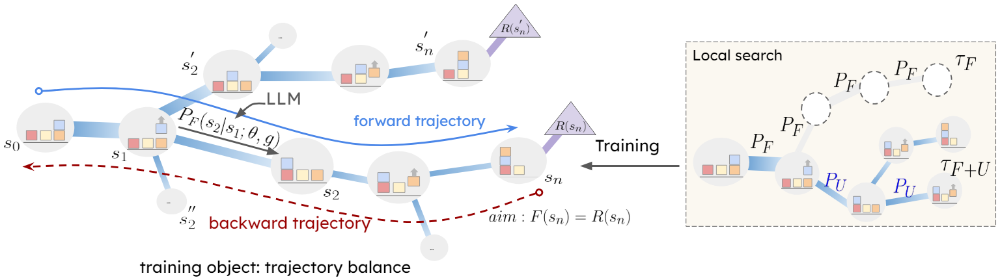

# Flow of Reasoning: Efficient Training of LLM Policy with Diverse Reasoning

We focus on generating diverse solution trajectories in multi-step reasoning problems. Specifically, we formulate LLM reasoning as a Markovian flow from an initial state to terminals and adapt the GFlowNets training approach to enable diverse reasoning and apply our method to embodied reasoning (BlocksWorld), puzzle solving (Game of 24), and logical reasoning (PrOntoQA) tasks. 

Our Flow of Reasoning (FoR) leads to:

1. Diverse-Reasoning: Multiple reasoning solutions to the reasoning tasks can be found via sampling.
2. Sample-Efficiency: Limited data (e.g. 15 examples) can train the LLM policy well.

Find more details in our paper:
Fangxu Yu, Lai Jiang, Haoqiang Kang, Shibo Hao, Lianhui Qin, "[GFlowPlanner: Efficient Training of LLM Policy for Diverse Reasoning]()" (* Equal contribution)

## FoR



Our GFlowPlanner formulates multi-step reasoning tasks as flow:
1. Design reward $R(s_n)$ of terminal states for different tasks.
2. Collect trajectories with the local search technique.
3. Training LLM policy $P_{F}$ with trajectory balance loss.

## Code
**1) Download this GitHub**
```
git clone https://github.com/Yu-Fangxu/FoR.git
```

**2) Prepare the environment**
We recommend conda for setting up a reproducible experiment environment. We include `environment.yaml` for creating a working environment:

```
bash install.sh
```

**3) Choose one of 3 tasks to run**
```
cd BlocksWorld|Game24|prontoqa
```

<br> **If you find our repository helpful to your research, please consider citing:** <br>
```
@article{guo2024cold,
  title={COLD-Attack: Jailbreaking LLMs with Stealthiness and Controllability},
  author={Guo, Xingang and Yu, Fangxu and Zhang, Huan and Qin, Lianhui and Hu, Bin},
  journal={arXiv preprint arXiv:2402.08679},
  year={2024}
}
```
