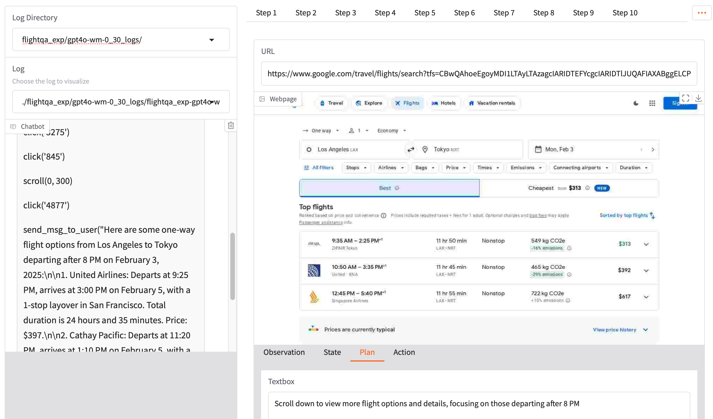

# ReasonerAgent: A fully open source, ready-to-run agent that uses a web browser to answer your queries

<p align="center">
    <a href="https://reasoner-agent.maitrix.org" class="nav-link mt-1 mb-1 enabled"> 
    <i class="fa-solid fa-newspaper"></i>
    <span>Blog</span>
    </a>
    |
    <a href="https://easyweb.maitrix.org" class="nav-link mt-1 mb-1 enabled"> 
    <i class="fas fa-solid fa-rocket"></i>
    <span>Research Preview (Demo)</span>
    </a> 
    |
    <a href="https://discord.gg/b5NEhRbvJg" class="nav-link mt-1 mb-1 enabled">
    <i class="fas fa-brands fa-discord"></i>
    <span>Discord</span>
    </a>
    |
    <a href="https://maitrix.org" class="nav-link mt-1 mb-1 enabled">
    <i class="fas fa-solid fa-at"></i>
    <span>Maitrix.org</span>
    </a> 
    <br>
    
</p>
ReasonerAgent is an agent that answers user queries by operating a Chormium-based browser interface. By planning its actions with simulation-based reasoning using a world model, ReasonerAgent is capable of completing a range of web browsing tasks, such as complex website navigation, multi-hop, multi-website QA, and general web automation. Since it is built free of additional training, ReasonerAgent can be executed by simply providing an API key. It is a preliminary implementation showcasing our research, and limitations exist. We encourage the community to provide feedback for further refinement and improvement.

This example code runs the [agent](/reasoners/agent) implemented by LLM Reasoners in the open web environment. We also included a baseline agent based on `BrowsingAgent` from [OpenHands](https://github.com/All-Hands-AI/OpenHands).


<!-- <div style="text-align: center;">
    <iframe width="80%" height="315" src="https://www.youtube.com/embed/KUlf0hZuCXQ?si=z0T3M1SZYID_B3Pr" title="YouTube video player" frameborder="0" allow="accelerometer; autoplay; clipboard-write; encrypted-media; gyroscope; picture-in-picture; web-share" referrerpolicy="strict-origin-when-cross-origin" allowfullscreen></iframe>
</div> -->

<!-- ## News 
-  -->
## ⚡ Quick Start
First, go through the [installation](#install) section. Then you can test run your first query:
```
python main.py test_job --query "Who is the current president of USA?" --api_key "sk-123[Your OpenAI API key]"
```

## 📖 Documentation
### Install
1. Install [Playwright](https://playwright.dev/docs/intro#installing-playwright). You might need to first install [npm](https://docs.npmjs.com/downloading-and-installing-node-js-and-npm).
2. Install the browser and dependencies with Playwright. For example, on Ubuntu you can do `playwright install` followed by `npx playwright install-deps`. Alternatively you can skip this step and follow the instructions when prompted later.
3. Make sure to use Python 3.10 or later
```
conda create -n reasoners python=3.10
conda activate reasoners
```
4. Install from Github
```
# Locally install llm-reasoners
git clone https://github.com/maitrix-org/llm-reasoners.git
cd llm-reasoners
pip install -e .
# Install dependencies for ReasonerAgent
cd examples/ReasonerAgent-Web
pip install -r requirements.txt
```
**Note**: If any issue arises while trying to install BrowserGym, please refer to the [official repo](https://github.com/ServiceNow/BrowserGym).

### Running Experiments
Before starting, it is recommended that you enter your API key at a file named `default_api_key.txt` under `examples/ReasonerAgent-Web/`.
We recommend a minimum of 16GB RAM, as required by Playwright for proper system functionality.

**Run with Single Query**
```
python main.py \
    [job_name] \
    --query [your query] \
    --agent [optional, reasoner, openhands; default: reasoner] \
    --config_name [optional, only applies to reasoner agent; 
                   options: browsergym, browsergym_world_model, opendevin, opendevin_llama, opendevin_world_model, opendevin_webarena, opendevin_webarena_world_model, browsergym_webarena, browsergym_webarena_world_model;
                   default: browsergym] \
    --model [optional, 
             options: gpt-4o, o1, o3-mini, deepseek-chat, deepseek-reasoner; 
             default: gpt-4o] \
    --api_key [optional, by default set to content in file llm-reasoners/examples/ReasonerAgent-Web/default_api_key.txt if exists, otherwise None] \
    --max_steps [optional, maximum steps the agent can take on a single task; default: 30] \
    --output_dir [optional, location to store browsing interaction data; default: ./browsing_data]
```

**Run with an Evaluation Dataset**

We provide three datasets for evaluating web agents as informational assistants: 
1. [FanOutQA](https://fanoutqa.com/index.html), which requires the agent to answer questions that require searching for and compiling information from multiple websites. We include their development set of 310 examples. 
2. FlightQA, a dataset prepared by us to evaluate the ability of LLM agents in answering queries with varying number of constraints, specifically while searching for live flight tickets using the internet. To control for confounding variables like specific query content, we iteratively add to lists of constraints to form new questions. In total we have 120 examples consisted of 20 groups of questions ranging from 3 to 8 constraints.
3. [WebArena](https://webarena.dev), which comprises benchmarking tasks on a few self-hosted websites, including information seeking, site navigation and content management. 
```
python main.py \
    [job_name] \
    --dataset [fanout, flightqa, webarena] \
    --agent [optional, reasoner, openhands; default: reasoner] \
    --config_name [optional, only applies to reasoner agent; 
                   options: browsergym, browsergym_world_model, opendevin, opendevin_llama, opendevin_world_model, opendevin_webarena, opendevin_webarena_world_model, browsergym_webarena, browsergym_webarena_world_model
                   default: browsergym] \
    --model [optional, 
             options: gpt-4o, o1, o3-mini, deepseek-chat, deepseek-reasoner; 
             default: gpt-4o] \
    --api_key [optional, by default set to content in file 'llm-reasoners/examples/ReasonerAgent-Web/default_api_key.txt' if exists, otherwise None] \
    --max_steps [optional, maximum steps the agent can take on a single task; default: 30] \
    --output_dir [optional, location to store browsing interaction data; default: ./browsing_data] \
    --start_idx [optional, index of the first example; default: 0] \
    --end_idx [optional, index of the last example; default: 9999999] \
    --shuffle [store_true, whether to shuffle the dataset before slicing with start_idx and end_idx] \
    --seed [optional, used as seed when --shuffle is set; default: 42] 
```

**Notes:**
* One way to speed up the dataset inference is to open several terminals and run inference on separate slices of the data.
* The agent outputs will be stored under `browsing_data` and will be automatically loaded for evaluation.
* Optionally, `--model` can be set to path to a config file for module-wise LLM specification. Example config files with which we ran our experiments are provided [here](configs/).
* Running WebArena requires setup on an Amazon EC2 Instance following the [official guide](https://github.com/web-arena-x/webarena/blob/main/environment_docker/README.md#pre-installed-amazon-machine-image-recommended). Then the evaluation can be run with the example [script](evaluation/webarena/run_inference.sh) provided.

### Get Evaluation Results
After experiments with evaluation datasets are done, follow the instructions below to get quantitative evaluation results.

**FanOutQA**
```
cd evaluation/fanout
python run.py \
    [job_name] \
    --browsing_data_dir [optional, should be same as output_dir when running experiments;
                         default: ../../browsing_data] \
    --groundtruth_path [optional, path to the groundtruth info file;
                        default: ../../data/fanout-final-dev.json] \
    --start_idx [optional, used if only partially evaluating the results; default: 0] \
    --end_idx [optional, used if only partially evaluating the results; default: 9999]
```

**FlightQA**
```
cd evaluation/flight
python run.py \
    [job_name] \
    --browsing_data_dir [optional, should be same as output_dir when running experiments;
                         default: ../../browsing_data] \
    --questions_path [optional, path to the constraint info file;
                        default: ../../data/flightqa_counterfactual.csv] \
    --start_idx [optional, used if only partially evaluating the results; default: 0] \
    --end_idx [optional, used if only partially evaluating the results; default: 9999]
```
Note: Running evaluation for FlightQA involves calling `gpt-4o` with the API key at `default_api_key.txt`, which may incur costs to you. So please run judiciously.

**WebArena**
```
cd evaluation/webarena
```
To get the success rate:
```
python get_success_rate.py \
    output_root [should be same as output_dir when running experiments, should contain output.jsonl]
    -v [optional flag, verbose option to print success instance indices]
```
To get the paired sample T-test result:
```
python get_ttest.py \
    output_pre [path to dictionary containing output.jsonl] \
    output_post [path to dictionary containing output.jsonl]
```

### Visualize History Log
We provided a frontend to visualize the interaction history for the experiments. Run it locally with the following command:
```
python log_visualizer/main.py
```
Then open the link in the command line output. You will be able to interact with an interface like this:
<p align="center">
    
</p>

## 🤝 How to Contribute
This project is fully open-sourced. We encourage the community to contribute and share any invaluable feedbacks. Here are a few ways to reach us:
- [**Discord**](https://discord.com/invite/b5NEhRbvJg) - Join the Maitrix discord server and share any feedback under the #llm-reasoners channel.
- [**Github Issue**](https://github.com/maitrix-org/llm-reasoners/issues) - Check out the current issues we're working on, or add your own ideas.
- **Email** - Mingkai Deng (mingkaid34@gmail.com); Jinyu Hou (hou.jinyu@outlook.com)

## 📝 Cite
```
@misc{reasoneragent2025,
    title = {ReasonerAgent: A Fully Open Source, Ready-to-Run Agent That Uses a Web Browser to Answer Your Queries},
    url = {https://reasoner-agent.maitrix.org/},
    author = {Chiou, Brandon and Choey, Mason and Deng, Mingkai and Hou, Jinyu and Wang, Jackie and Wu, Ariel and Xu, Frank and Hu, Zhiting and Jin, Hongxia and Li, Li Erran and Neubig, Graham and Shen, Yilin and Xing, Eric P.},
    month = {February},
    year = {2025}
}
```
