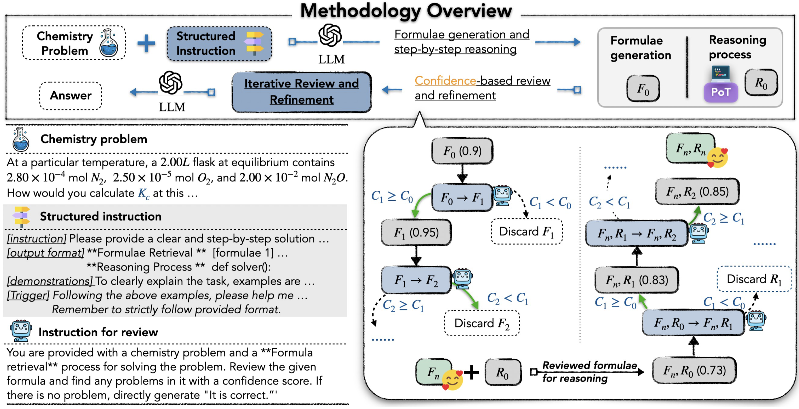

# Examples

## StructChem: Structured Chemistry Reasoning with Large Language Models

[Siru Ouyang](https://ozyyshr.github.io/), [Zhuosheng Zhang](https://bcmi.sjtu.edu.cn/~zhangzs/), [Bing Yan](https://bingyan.me/), [Xuan Liu](https://scholar.google.com/citations?user=XbtWYioAAAAJ&hl=en), [Yejin Choi](https://yzjiao.github.io/), [Yejin Choi](https://homes.cs.washington.edu/~yejin/), [Jiawei Han](https://hanj.cs.illinois.edu/), [Lianhui Qin](https://sites.google.com/view/lianhuiqin/home)

StructChem is a simple yet effective prompting strategy that offers the desired guidance and substantially boosts the LLMs' chemical reasoning capability.

<p align="center">
    
</p>

There are three key components in StructChem:

1. Formulae generation: we instruct the LLM not only to recite the formulae but also to provide explanations for the variables they contain.

2. Step-by-step Reasoning: grounded on the generated formulae, the LLMs can then reason about the solution to the original question.

3. Confidence-based Review-and-Refinement: we estimate a confidence score on the revision process. Only a high-confidence revision is accepted for further refinement in the next iteration.

**Setup**

Please download [SciBench](https://github.com/mandyyyyii/scibench) dataset and put the test set directly under this folder like this:

```bash
./examples/StructChem/chemmc.json
```

**How to Run**

To run StructChem on the datasets, simply using:

```bash
OPENAI_API_KEY="your_api_key" python examples/StructChem/inference.py --data_path "examples/StructChem/chemmc.json"
```

For "formulae generation" and "reasoning process", we explicitly disentangle them:

```python
with io.StringIO() as f:
    f.write(initial_instruction.strip()+"\n\n")
    f.write(f"Now try to solve the following problem:\n{problem}")
    model_input = f.getvalue()

output = base_model.generate(
    [model_input],
    max_new_tokens=512,
    hide_input=False,
    do_sample=True,
    top_k=32000,
    top_p=0.95,
    temperature=temperature,
    eos_token_id='\n',
    num_return_sequences=1
).text[0].strip()

formulae, reasoning = extract_formulae_reasoning(output)
```

The "iterative review and refinement" is implemented as "tree search":

```python
## 2.1 Initiate the refinement process for formulae in a tree-searching style
algo_output = reasoner_f(example['problem_text'] + "<concatenate>" + formulae)
# get the last state
state = algo_output.terminal_state[-1]
# get the final refined formulae
output_formulae = state.formulae

## 2.2 Initiate the refinement process for reasoning in a tree-searching style
algo_output = reasoner_r(example['problem_text'] + "<concatenate>" + output_formulae + "<concatenate>" + reasoning)
# get the last state
state = algo_output.terminal_state[-1]
# get the final refined reasoning
output_reasoning = state.reasoning
```
To plug in your own reasoning algorithms for refinement, you can change the state definition in `world_model.py` and how actions update in `search_config.py`.

Defaultly, we use beam search here.

```python
search_algo_params |= {
            'beam_size': beam_size, 
            'max_depth': max_depth,
            }
```

where "max_depth" controls the number of iterations of this process.

**Evaluation**

The program will return the final accuracy with integration of evaluation snippet as "quasi exact match".

## Reference
```
@article{ouyang2023structured,
  title={Structured chemistry reasoning with large language models},
  author={Ouyang, Siru and Zhang, Zhuosheng and Yan, Bing and Liu, Xuan and Choi, Yejin and Han, Jiawei and Qin, Lianhui},
  booktitle={Forty-first International Conference on Machine Learning},
  year={2024},
  url={https://openreview.net/forum?id=7R3pzxTSlg}
}
```
