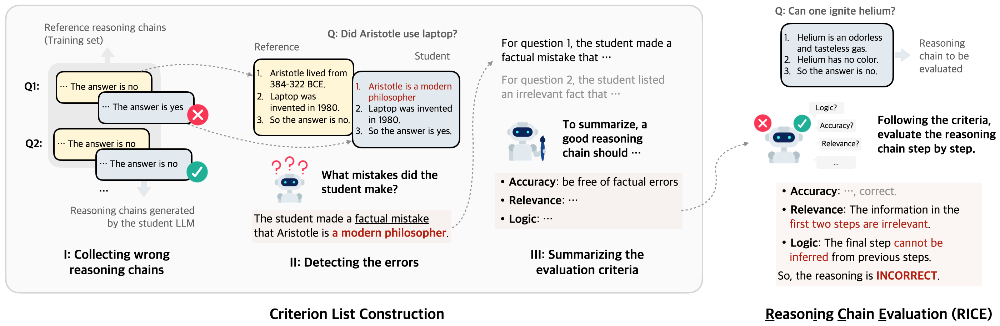
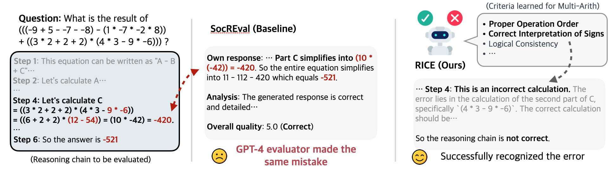
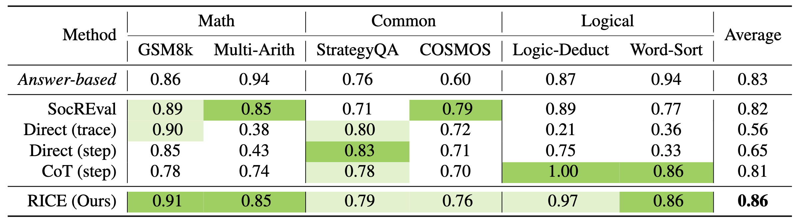
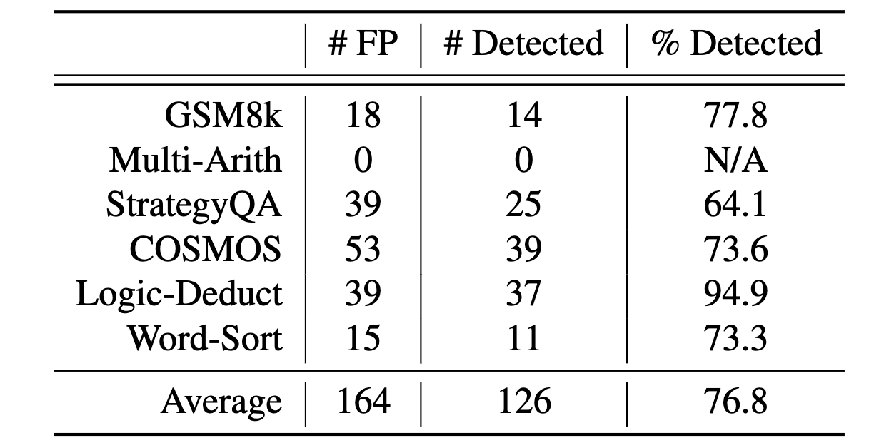
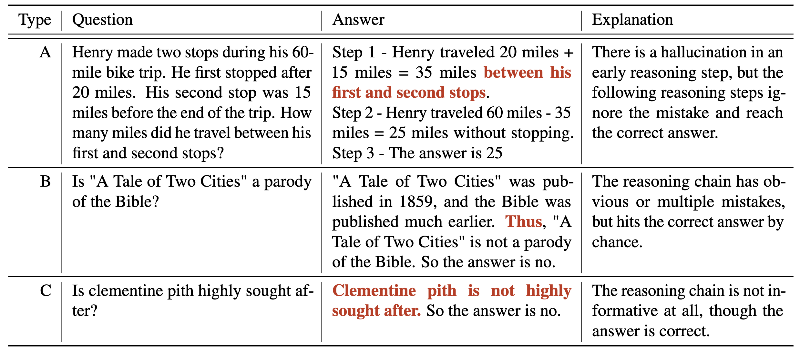

---

# Reasoning Chain Evaluation

To evaluate LLM reasoning algorithms, the common practice is to use the final answer accuracy of reasoning tasks as the proxy metric (i.e., answer-based evaluation). However, the correct answer does not always indicate the correctness of the reasoning chains, as there might be other confounding factors like spurious reasoning shortcuts (Golovneva et al., 2022; Ozturkler et al., 2022; Prasad et al., 2023; Tyen et al., 2023; Lyu et al., 2023). For example, in a random subset of StrategyQA (Geva et al., 2021), a popular commonsense reasoning dataset, our analysis revealed that 39% of the correct answers produced by Llama-2 70B were based on incorrect reasoning chains.

To tackle this challenge, several methods have been developed recently to assess the quality of reasoning chains. Early approaches involve fine-tuning small models to be the evaluator (Golovneva et al., 2022; Prasad et al., 2023), followed by several efforts to employ more powerful LLMs for automatic evaluation of reasoning chains (Tyen et al., 2023; He et al., 2023). Yet, the task remains challenging. Specifically, Tyen et al. (2023) prompted GPT-4 with few-shot examples to identify errors in reasoning chains, but it only successfully detected mistakes less than half of the time across most reasoning tasks. He et al. (2023) designed a detailed instruction prompt inspired by the Socratic method. It involves generating a reasoning chain with GPT-4 as the reference. However, the method relies on the assumption that GPT-4 can always solve the reasoning tasks correctly on its own, which limits its effectiveness for more complicated tasks.

Surprisingly, our findings indicate that GPT-4 is indeed able to evaluate reasoning chains, and the key is a clearly defined **evaluation criteria** list. For example, in math word problems, a correct reasoning chain should (a) contain no calculation errors, (b) be logically consistent, (c) avoid hallucinating any unknown information, etc. These criteria can guide LLMs to pay more attention to common errors for a certain reasoning task, thus being more accurate in evaluation. Inspired by this, we propose a new approach, **RICE**. It initially leverages an LLM to autonomously generate a criteria list for a given reasoning task. Subsequently, these criteria are used to prompt the LLM to serve as an evaluator of reasoning chains.

### Method

Figure 1: For any reasoning tasks (e.g., commonsense reasoning), RICE first constructs an evaluation criterion list <b>automatically</b> with GPT-4. This criterion list then guides GPT-4 to evaluate any reasoning chains step by step for this task.

To formulate the problem, we consider a reasoning question $x$, and LLM-generated reasoning chains $z$, and the predicted answer $y$. Additionally, we have the reference answer $y_r$. accompanied by a reference reasoning chain $ z_r $ (in training set). Our goal is to develop an automatic evaluation metric for the reasoning chain, $ s(z) \in \{0,1\} $, which is better aligned with human evaluation of the reasoning chains.
As mentioned above, we discovered that a criteria list is crucial for the LLM to function as an evaluator. Therefore, the key idea of RICE is to construct the criteria list with LLMs automatically, and then use it to evaluate new reasoning chains.

To construct the criteria list, one needs to understand what kinds of errors are common for a task. Therefore, RICE is designed to condense the criteria from real mistakes in LLM-generated reasoning chains.
We first need to collect reasoning chains with errors (Figure 1, I). Here, we make use of the fact that a reasoning chain reaching a wrong answer must include intermediate mistake.
Given a sub-sampled training set $D=\{(x, y_r, z_r)\}$, we run chain-of-thoughts reasoning with an LLM (referred as the student LLM) to expand the dataset to $D'=\{x, y_r, z_r, y, z\}$, where $z$ is the reasoning chain generated by the student and $y$ is the predicted answer extracted from $z$. Then, we filter out a subset where the generated answers disagree with the reference answers, $D_{\text{error}}=\{(x, y_r, z_r, y, z)\in D' \mid y_r \ne y\}$.

Having these reasoning chains with errors, the next goal is to compile a criteria list.
To reduce the difficulty, we divide it into two simple steps: *Detection* and *Summarization*.
The Detection step identifies the specific errors in a reasoning chain. GPT-4 is presented with the question, the reference reasoning chain, and the student reasoning chain. It is then instructed to point to the mistake in the student reasoning chain (Figure 1, II).
The underlying rationale is that, even if the question $x$ might be challenging for GPT-4 to solve on its own, it has a good chance of understanding the question and identifying the mistakes once the reference reasoning chain is provided. 

After collecting the errors in reasoning chains, GPT-4 is prompted to summarize these specific instances into a general criteria list (Figure 1, III). Eventually, GPT-4 is able to evaluate any new reasoning chain $z$ given a question $x$, by checking each criteria on each reasoning step.

### Experiments

To measure the efficacy of reasoning chain evaluation metrics, we use human-annotated binary correctness labels of reasoning chains as the ground truth and calculate their accuracy.

**Datasets:** We experiment on 6 datasets covering mathematical, commonsense, and logical reasoning. Five of them are from previous works (Golovneva et al. 2022; Tyen et al. 2023), originating from GSM8K (Cobbe et al. 2021), Multistep-Arithmetics (BIG-bench 2023), DROP (Dua et al. 2019), COSMOS-QA (Huang et al. 2019), Logical-Deduction (BIG-bench 2023) and Word-Sorting (BIG-bench 2023). We additionally sample and manually label reasoning chains from StrategyQA (Geva et al. 2021).

Figure 2: A case study on MultiArith. SocREval requires GPT-4 to generate its own response to the problem, which is wrong in this case. RICE successfully recognized the calculation error, guided by the criterion list learned for this task.

**Baselines:** We compare RICE with other LLM-based evaluation metrics for reasoning chains. (a) **SocREval** (He et al. 2023) crafts a detailed instruction prompt through the Socratic method, which includes asking GPT-4 to generate a reference reasoning chain before evaluation. This method also requires a one-shot demonstration written by humans for each task. Tyen et al. (2023) propose three methods: (b) **Direct (trace)** asks GPT-4 to directly evaluate a reasoning chain; (c) **Direct (step)** asks GPT-4 to check the reasoning step by step; (d) **CoT (step)** asks GPT-4 to generate a reasoning process before evaluating each reasoning step. All these methods require 3-shot demonstrations written by humans. We don't experiment with metrics based on small models, including ROSCOE (Golovneva et al. 2022) and ReCEval (Prasad et al. 2023), as existing literature indicates a substantial performance gap between these methods and LLM-based metrics (He et al. 2023).

Table 1: Comparative results of classification accuracy using various reasoning chain evaluation metrics.

**Results:** The results to compare various evaluation methods are presented in Table 1. We can observe that among all metrics for reasoning chains, RICE achieves the best overall performance. It excels in 3 out of 6 tasks and exhibits robustness, maintaining performance levels within 5% of the best results across the board. Note that, unlike all baselines, which require human-written demonstrations, RICE does not need any human input specific to reasoning tasks. As a case study shown in Figure 2, we even find that RICE enables GPT-4 to evaluate reasoning chains on problems challenging to GPT-4 itself. Specifically, in a problem from MultiArith, SocREval fails because GPT-4 generates the reference with the same mistakes as the reasoning chain to be evaluated, but RICE identifies the tricky errors with the detailed criteria. We also list the comparison of cost in Appendix B.

Table 2: False positive reasoning chain detection of RICE. It can detect a large portion of the false positive reasoning chains, which indicates the promise to complement answer-based evaluation.

Moreover, when compared with the answer-based metric, RICE also outperforms it in 4 of 6 tasks with better overall performance. We additionally calculate the accuracy of RICE on reasoning chains with mistakes but reaching a correct answer (false positive reasoning chains), and it turns out that RICE managed to detect 64% to 95% of the false positive reasoning chains across different tasks (Table 2). We examine some false positive reasoning chains detected by RICE and find the explanation given by RICE is mostly reasonable. Except in the case where the reference label $y_r$ is wrong, the false positive reasoning chains can be mainly classified into 3 types (Table 3). Overall, we believe RICE would be a very useful and complementary metric to answer-based evaluation. 

Table 3: Common types of false positive reasoning chains detected by RICE.

